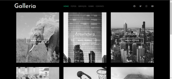
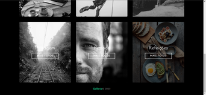
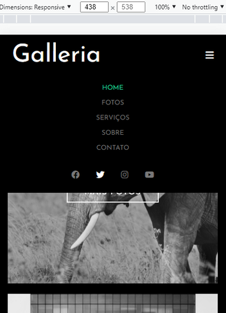
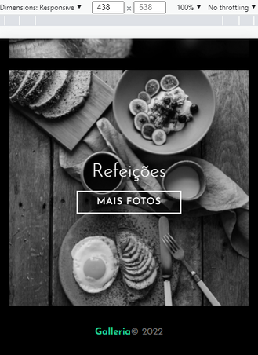
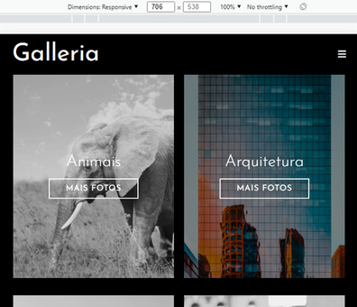

<h1 align="center">Welcome to Galleria 👋</h1>
<p align="center">
  <a href="./LICENSE" target="_blank">
    
  </a>
  <a href="https://img.shields.io/github/issues/Gustavo-Victor/galleria" target="_blank">
    
  </a>
  <a href="https://img.shields.io/github/forks/Gustavo-Victor/galleria" target="_blank">
    
  </a>
  <a href="https://img.shields.io/github/stars/Gustavo-Victor/galleria" target="_blank">
    
  </a>
</p>

> Simple image gallery page using sass

<p align='center'>
    <a href='#-about-the-project'>• About the project</a>  
    <a href='#-screenshots'>• Screenshots</a>  
    <a href='#-how-to-use'>• How to Use</a>  
    <a href='#-features'>• Features</a>    
    <a href='#-learnings'>• Learnings</a>
    <a href='#-author'>• Author</a>  
    <a href='#-show-your-support'>• Show Your Support</a>
    <a href='#-license'>• Licence</a>    
</p>

<p align='center'>🚀Project Completed ✅ </p>

## 💻 About the Project

This project is a simple image gallery page made using HTML, CSS, JS and SASS. The purpose of the project is to serve as an introduction to the css preprocessor (SASS) as a form of study and practice. 

The project was customized by me, but it was based on a youtube tutorial from the "Hora de Codar" channel. [Click here](https://www.youtube.com/watch?v=Wo5t3uUV8n4) if you want to go to the video.

## 🎨 Screenshots
### Desktop / Laptop 




### Mobile 





## 🚀 How to Use

Before you start, you will need to install [Git](https://git-scm.com/) and also a powerful code editor like [Visual Studio Code](https://code.visualstudio.com/) to clone, test and modify this repository on your machine. To understand the code, you need to have basic knowledge of HTML, CSS, and SASS.
There's no secret, after having cloned the project, to run it on your machine, just open the "index.html" file in any browser. But if you want to modify the sass files and automatically update the css files, just follow the steps below:

```bash
    # Enter the project folder
    $ cd galleria/

    # Install sass on your machine globally 
    $ npm i -g sass 

    # Compile sass file to css file and automatically update
    $ npm run sass 

    # Now just open the 'index.html' file in any browser and start coding
```
## 🛠 Features

The following tools were used in building this project.
### Languages 
- [HTML5](https://developer.mozilla.org/pt-BR/docs/Web/HTML)
- [CSS3](https://developer.mozilla.org/pt-BR/docs/Web/CSS) 
- [JavaScript](https://www.javascript.com/)
- [SASS](https://sass-lang.com/)

## 🏅 Learnings

During the development of the project, I was able to learn more about fundamental SASS concepts like imports, nested rules, mixins, extensions, referencing, etc. SASS is really very powerful!
## 👤 Author

**Gustavo Victor**

* Github: [@Gustavo-Victor](https://github.com/Gustavo-Victor)
* LinkedIn: [@gustavo-victor-575b93206\/](https://linkedin.com/in/gustavo-victor-575b93206\/)

## Show your support

Give a ⭐️ if this project helped you!

## 📝 License

Copyright © 2022 [Gustavo Victor](https://github.com/Gustavo-Victor).<br />
This project is [MIT](./LICENSE) licensed. Anyone can use and contribute to this project.


